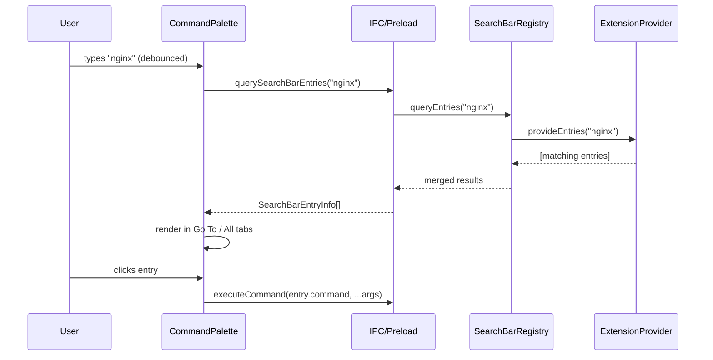

# Searchbar Extension API

## Architecture

The provider pattern uses lazy, query-driven fetching instead of pushing all entries up front. This scales from a handful of page-level entries to thousands of Kubernetes resources.



When providers are registered or unregistered, the registry sends a `searchbar-providers-changed` event so the renderer knows to re-query.

## API Design

### Extension-facing types (`@podman-desktop/api`)

```typescript
export interface SearchBarEntry {
  id: string;
  label: string;
  description?: string;
  icon?: string | { light: string; dark: string };
  command: string;
  commandArgs?: unknown[];
}

export interface SearchBarEntryProvider {
  provideEntries(query: string): ProviderResult<SearchBarEntry[]>;
}
```

`ProviderResult<T>` is `T | undefined | PromiseLike<T | undefined>`, already defined in the extension API.

### Extension-facing method

```typescript
export namespace navigation {
  export function registerSearchBarEntryProvider(provider: SearchBarEntryProvider): Disposable;
}
```

### IPC-facing type (`@podman-desktop/core-api`)

```typescript
export interface SearchBarEntryInfo {
  id: string;
  label: string;
  description?: string;
  icon?: string | { light: string; dark: string };
  command: string;
  commandArgs?: unknown[];
  extensionId: string;
  extensionIcon?: string | { light: string; dark: string };
}
```

### Extension usage examples

**Static page entries (e.g. BootC):**

```typescript
import * as api from '@podman-desktop/api';

export function activate(ctx: api.ExtensionContext) {
  const entries: api.SearchBarEntry[] = [
    { id: 'bootc-dashboard', label: 'BootC > Dashboard', command: 'bootc.navigateToDashboard' },
    { id: 'bootc-builds', label: 'BootC > Builds', command: 'bootc.navigateToBuilds' },
  ];

  ctx.subscriptions.push(
    api.navigation.registerSearchBarEntryProvider({
      provideEntries(_query: string) {
        // static entries -- always returned, filtering is done by the renderer
        return entries;
      },
    }),
  );
}
```

**Dynamic resource entries (e.g. Kubernetes pods):**

```typescript
import * as api from '@podman-desktop/api';

export function activate(ctx: api.ExtensionContext) {
  ctx.subscriptions.push(
    api.navigation.registerSearchBarEntryProvider({
      async provideEntries(query: string) {
        const pods = await listPods(); // extension-internal
        return pods
          .filter(p => p.name.includes(query))
          .slice(0, 50) // cap results for performance
          .map(p => ({
            id: `k8s-pod-${p.namespace}-${p.name}`,
            label: `Kubernetes > Pod: ${p.name}`,
            description: `Namespace: ${p.namespace}`,
            command: 'kubernetes.navigateToPod',
            commandArgs: [p.namespace, p.name],
          }));
      },
    }),
  );
}
```

## Changes by Layer

### 1. Shared types -- `packages/api`

- Create [`packages/api/src/searchbar-entry-info.ts`](packages/api/src/searchbar-entry-info.ts) with the `SearchBarEntryInfo` interface (serializable IPC form with `extensionId` and `extensionIcon` fields).
- Export from [`packages/api/src/index.ts`](packages/api/src/index.ts).
- Add `'searchbar-providers-changed': never` to [`packages/api/src/api-sender/api-sender-channel-map.ts`](packages/api/src/api-sender/api-sender-channel-map.ts).

### 2. Extension API types -- `packages/extension-api`

- Add `SearchBarEntry` interface, `SearchBarEntryProvider` interface, and `navigation.registerSearchBarEntryProvider(provider): Disposable` to [`packages/extension-api/src/extension-api.d.ts`](packages/extension-api/src/extension-api.d.ts).

### 3. Main process -- `packages/main`

- Create [`packages/main/src/plugin/searchbar-registry.ts`](packages/main/src/plugin/searchbar-registry.ts) -- an `@injectable()` `SearchBarRegistry` class that:
  - Stores providers per extension in a `Map<string, { provider, extensionId, extensionIcon }>`.
  - `registerProvider(extensionId, extensionIcon, provider)` -> `Disposable` (sends `searchbar-providers-changed`).
  - `async queryEntries(query: string): Promise<SearchBarEntryInfo[]>` -- calls all providers in parallel via `Promise.allSettled`, merges results, attaches `extensionId` and `extensionIcon` to each entry.
  - `init()` registers IPC handle `searchbar:queryEntries(query)`.
- Register in DI container in [`packages/main/src/plugin/index.ts`](packages/main/src/plugin/index.ts).
- In [`packages/main/src/plugin/extension/extension-loader.ts`](packages/main/src/plugin/extension/extension-loader.ts), inject `SearchBarRegistry` and expose `navigation.registerSearchBarEntryProvider()` in `createApi()`, resolving icon paths via `updateImage()` and defaulting to the extension icon.

### 4. Preload bridge -- `packages/preload`

- Add `querySearchBarEntries(query: string): Promise<SearchBarEntryInfo[]>` to [`packages/preload/src/index.ts`](packages/preload/src/index.ts), invoking `searchbar:queryEntries`.

### 5. Renderer

- Create [`packages/renderer/src/stores/searchbar-entries.ts`](packages/renderer/src/stores/searchbar-entries.ts):
  - A writable store of `SearchBarEntryInfo[]`.
  - An exported `querySearchBarEntries(query: string)` function that calls `window.querySearchBarEntries(query)` and updates the store.
  - Listens to `searchbar-providers-changed` (plus `extension-started`/`extension-stopped`) to know when to re-query.
- Update [`packages/renderer/src/lib/dialogs/CommandPalette.svelte`](packages/renderer/src/lib/dialogs/CommandPalette.svelte):
  - Import the new store.
  - On input change (debounced ~150ms), call `querySearchBarEntries(inputValue)`.
  - On palette open with empty query, call once to get static entries.
  - Merge extension entries into Go To and All filtered lists.
  - On click, call `window.executeCommand(entry.command, ...entry.commandArgs)`.
  - Display icon from `entry.icon` or `entry.extensionIcon` as fallback via ``.
- Update [`packages/api/src/documentation-info.ts`](packages/api/src/documentation-info.ts) to add `'Extension'` to the `GoToInfo` union, or introduce a distinct `CommandPaletteItem` variant for extension entries to avoid coupling.

### 6. Tests

- Unit tests for `SearchBarRegistry` (register provider, dispose, queryEntries, parallel provider failure handling).
- Unit tests for `extension-loader.ts` -- verify `navigation.registerSearchBarEntryProvider` wires correctly.
- Unit tests for the renderer store (query, re-query on event).
- Update `CommandPalette.spec.ts` to cover extension entries display and click behavior.

## Key Design Decisions

- **Provider pattern over static registration**: Extensions implement `provideEntries(query)` which is called lazily when the user types. This avoids shipping thousands of entries over IPC and lets extensions do their own filtering/pagination (e.g. `slice(0, 50)`).
- **Debounced queries**: The renderer debounces input changes (~150ms) before calling providers, avoiding excessive IPC round-trips.
- **`Promise.allSettled` for resilience**: If one provider throws or times out, other providers still return results.
- **Command-based actions**: Entries execute a registered command on click, consistent with `StatusBarItem.command`.
- **Icon fallback**: If no `icon` is provided on the entry, the extension's own icon (from its manifest) is used.
- **`navigation` namespace**: Searchbar entries are navigation targets. Placing the API on `navigation` (alongside `navigation.register` and the `navigateTo*` methods) is more consistent than overloading `window`, which is reserved for UI primitives (panels, dialogs, messages).
- **Auto-cleanup on disable**: The `Disposable` returned from `registerSearchBarEntryProvider` is pushed to `analyzedExtension.subscriptions`, so entries are removed when the extension stops.
- **Serializable over IPC**: `SearchBarEntryInfo` uses plain strings for icons (no Svelte components). The renderer converts them to `` elements.
