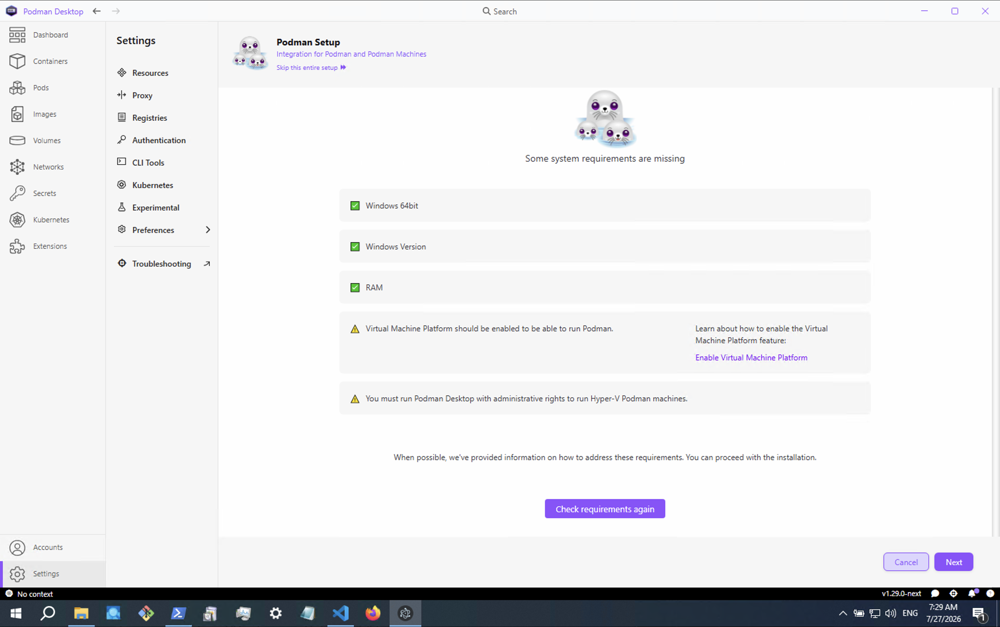

import ThemedImage from '@theme/ThemedImage';

Podman Desktop 1.30 Release

Podman Desktop 1.30 is now available. [Click here to download it](/downloads)!

This release includes new features, bug fixes, and continues the Svelte 5 migration:

- **Bulk container stop**: Select multiple running containers and stop them in one click.
- **Warning-level preflight checks**: Preflight checks on Windows can now warn instead of block.
- **No more console flashes on Windows**: Machine autostart no longer pops up a Command Prompt window.
- **Docker contexts as connections**: Each Docker context is now surfaced as its own container connection.
- **Extension API additions**: Searchable routes in the command palette and display names for configuration properties.

<!-- truncate -->

## Release details

### Bulk container stop

You can now select multiple containers from the list and stop them all with a single action.

<ThemedImage
  alt="Bulk stop action in the container list"
  sources={{
    light: require('./img/podman-desktop-release-1.30/bulk-stop-light.png').default,
    dark: require('./img/podman-desktop-release-1.30/bulk-stop-dark.png').default,
  }}
/>

### Warning severity for preflight checks

Preflight checks during onboarding previously only had two outcomes: pass or fail. The API now supports a **warning** severity. A check can flag a potential issue with a ⚠️ icon without blocking the setup.

On Windows, a new BIOS virtualization firmware check uses this: if hardware virtualization is not enabled in the BIOS and no hypervisor is present, the check reports a warning instead of a hard failure, so you can still proceed with the Podman installation.

### No more console window flashes on Windows

On Windows, autostarting a Podman machine at launch no longer causes a Command Prompt window to briefly flash on screen ([#19318](https://github.com/podman-desktop/podman-desktop/pull/19318)).

### Docker contexts as container connections

If you work with Docker alongside Podman, Podman Desktop now registers a separate container connection for each configured Docker context. Whether you have a local daemon, a remote host, or multiple Docker Desktop contexts, they all appear individually on the dashboard without manual switching.

### Extension API improvements

Two additions for extension authors:

- **Searchable routes in the command palette**: Extensions can now pass a `searchEntry` option to `navigation.register()` to make their pages discoverable from the command palette ([#18550](https://github.com/podman-desktop/podman-desktop/pull/18550)).
- **Configuration display names**: Extension manifests can now declare a `displayName` on configuration properties. When present, the Settings UI shows this label instead of the raw property key ([#19186](https://github.com/podman-desktop/podman-desktop/pull/19186), [#19203](https://github.com/podman-desktop/podman-desktop/pull/19203)).

### Other improvements

- **Keyboard shortcut validation utils**: New keyboard utilities for validating keyboard shortcuts ([#19314](https://github.com/podman-desktop/podman-desktop/pull/19314)).
- **CI telemetry detection**: Telemetry is now automatically disabled when a CI environment is detected ([#19266](https://github.com/podman-desktop/podman-desktop/pull/19266)).
- **FileInput disabled state and error display**: The `FileInput` component can now be disabled and display validation errors ([#19300](https://github.com/podman-desktop/podman-desktop/pull/19300)).
- **Table row onClick API**: The `Table` component now supports an `onClick` handler on rows ([#18893](https://github.com/podman-desktop/podman-desktop/pull/18893)).
- **ButtonRow component**: A new `ButtonRow` UI component standardizes button layout in dialogs and forms ([#18724](https://github.com/podman-desktop/podman-desktop/pull/18724)).
- **Button aria-pressed toggle support**: Buttons can now expose a `pressed` prop for accessible toggle behavior ([#18591](https://github.com/podman-desktop/podman-desktop/pull/18591)).
- **Themed image support in Icon**: The `Icon` component now supports themed images that adapt to light/dark modes ([#18558](https://github.com/podman-desktop/podman-desktop/pull/18558)).
- **Cancel long press on pointer movement**: Long press gestures are now properly cancelled when the pointer moves away ([#18569](https://github.com/podman-desktop/podman-desktop/pull/18569)).
- **Expandable settings navigation sections**: Settings navigation now supports expandable sections with children for better organization ([#19125](https://github.com/podman-desktop/podman-desktop/pull/19125)).
- **Navigation item pinning (backend)**: The backend now supports pinning navigation items to the top of the sidebar ([#18464](https://github.com/podman-desktop/podman-desktop/pull/18464)).
- **Network menu context contributions**: Extensions can now contribute menu actions to the network context menu ([#18601](https://github.com/podman-desktop/podman-desktop/pull/18601)).
- **Declarative env:/file: configuration defaults**: Configuration properties now support `env:` and `file:` prefixes for dynamic default values ([#18797](https://github.com/podman-desktop/podman-desktop/pull/18797)).
- **Infra container detection**: Podman Desktop now detects and labels infrastructure containers ([#18892](https://github.com/podman-desktop/podman-desktop/pull/18892)).
- **Startup update dialog improvements**: The dismiss buttons in the startup update dialog are now grouped under a "Later" dropdown ([#19194](https://github.com/podman-desktop/podman-desktop/pull/19194)).
- **Managed configuration for provider updates**: A new managed configuration controls whether provider update notifications are shown ([#17878](https://github.com/podman-desktop/podman-desktop/pull/17878)).
- **5M downloads banner on website**: A celebratory banner marks the 5 million downloads milestone ([#18533](https://github.com/podman-desktop/podman-desktop/pull/18533)).
- **Svelte 5 migration**: Over 100 renderer components migrated to Svelte 5 runes by [@gastoner](https://github.com/gastoner) and [@0xKalasi](https://github.com/0xKalasi), covering Preferences, Extensions, Containers, Volumes, Compose, Kubernetes resources, PVCs, and Icons.
- Replaced `got` with native `fetch` in image-registry ([#18523](https://github.com/podman-desktop/podman-desktop/pull/18523)).
- Removed `win-ca` dependency ([#18187](https://github.com/podman-desktop/podman-desktop/pull/18187)).
- Extracted `DockerDaemonMonitor` from the Docker extension ([#18524](https://github.com/podman-desktop/podman-desktop/pull/18524)).
- Switched ESLint from `parserOptions.project` to `projectService` ([#19265](https://github.com/podman-desktop/podman-desktop/pull/19265)).
- Bundled express instead of externalizing it in Vite ([#19239](https://github.com/podman-desktop/podman-desktop/pull/19239)).
- Used discriminated unions in `getMatchingConnectionFromProvider` ([#14840](https://github.com/podman-desktop/podman-desktop/pull/14840)).
- Bumped Podman v5 to 5.8.7 and Podman v6 to 6.1.2.

### Notable bug fixes

- **Windows console flash**: Background process spawning on Windows no longer flashes a console window ([#19318](https://github.com/podman-desktop/podman-desktop/pull/19318)).
- **High-contrast navbar focus**: The focus outline on selected navbar items is now visible in high-contrast themes ([#19323](https://github.com/podman-desktop/podman-desktop/pull/19323)).
- **Rosetta configuration**: The Podman extension now always writes an explicit Rosetta value in `containers.conf`, preventing silent misconfigurations ([#19238](https://github.com/podman-desktop/podman-desktop/pull/19238)).
- **Remote Podman connections**: Connections that have no Identity field are now registered correctly ([#19147](https://github.com/podman-desktop/podman-desktop/pull/19147)).
- **Zstd decompression bombs**: Streaming zstd layer decompression now rejects decompression bombs ([#19166](https://github.com/podman-desktop/podman-desktop/pull/19166)).
- **Atomic configuration writes**: Storage and configuration files now use atomic writes and serialization, preventing corruption on concurrent access ([#19071](https://github.com/podman-desktop/podman-desktop/pull/19071)).
- **UTF-8 log streaming**: Multi-byte UTF-8 characters split across stream chunks are now preserved correctly in container logs ([#17994](https://github.com/podman-desktop/podman-desktop/pull/17994)).
- **WSL error surfacing**: WSL errors are now surfaced directly instead of showing misleading notifications ([#17936](https://github.com/podman-desktop/podman-desktop/pull/17936)).
- **Accurate memory usage**: The dashboard now uses `memAvailable` for accurate Podman memory usage reporting ([#18418](https://github.com/podman-desktop/podman-desktop/pull/18418)).
- **Container command display**: The full container command is now shown, not only its first argument ([#18561](https://github.com/podman-desktop/podman-desktop/pull/18561)).
- **Typeahead cleanup**: The Typeahead input delay timeout is now properly cleared on component destruction ([#19223](https://github.com/podman-desktop/podman-desktop/pull/19223)).
- **Slider styling**: The preferences slider track now shows a proper two-tone fill gradient ([#19158](https://github.com/podman-desktop/podman-desktop/pull/19158)).
- **Network name ordering**: Network views now show the network name before the ID ([#18917](https://github.com/podman-desktop/podman-desktop/pull/18917)).
- **Lima empty configuration values**: Empty Lima configuration values are now treated as unset ([#18639](https://github.com/podman-desktop/podman-desktop/pull/18639)).
- **Registry path spaces**: Spaces in registry configuration paths are now supported on Podman ([#18542](https://github.com/podman-desktop/podman-desktop/pull/18542)).
- **Hyper-V cleanup during migration**: Hyper-V VMs are now cleaned up during migration data reset ([#18791](https://github.com/podman-desktop/podman-desktop/pull/18791)).
- **Welcome page overlay**: The resize handle no longer appears above the welcome overlay ([#18998](https://github.com/podman-desktop/podman-desktop/pull/18998)).
- **Long error messages**: Long unbreakable error messages now wrap correctly in the UI ([#19301](https://github.com/podman-desktop/podman-desktop/pull/19301)).
- **Tooltip after menu close**: Tooltips no longer reappear after a menu closes ([#18864](https://github.com/podman-desktop/podman-desktop/pull/18864)).
- **Dashboard socket liveness on Linux**: The Podman tile on the dashboard now correctly updates socket liveness on Linux ([#18580](https://github.com/podman-desktop/podman-desktop/pull/18580)).
- **Toggle Timestamps accessibility**: The Toggle Timestamps button in container logs now has proper accessibility attributes ([#18627](https://github.com/podman-desktop/podman-desktop/pull/18627)).
- **Sentence case for tab labels**: Tab labels now use consistent sentence case ([#18885](https://github.com/podman-desktop/podman-desktop/pull/18885)).
- **App navigation resize glitch**: The sidebar navigation no longer glitches when resizing ([#18593](https://github.com/podman-desktop/podman-desktop/pull/18593)).
- **Task Manager deep-linking**: Clicking "see more" on a failed connection lifecycle task now navigates to the actual connection page instead of the generic Resources list ([#19345](https://github.com/podman-desktop/podman-desktop/pull/19345)).
- **Experimental feature feedback dialog**: The dialog was never shown at startup because it fired before the renderer was ready. It now waits for extensions to finish loading ([#18562](https://github.com/podman-desktop/podman-desktop/pull/18562)).

---

## Community thank you

Thank you to everyone who contributed to this release:

- [atirna](https://github.com/atirna) in [feat(ui): add ButtonRow component](https://github.com/podman-desktop/podman-desktop/pull/18724)
- [cblecker](https://github.com/cblecker) in [refactor(main): extract macOS login minimize preference helper](https://github.com/podman-desktop/podman-desktop/pull/19080)
- [DevShiba](https://github.com/DevShiba) in [feat(extensions): support menu context contribution for networks](https://github.com/podman-desktop/podman-desktop/pull/18601)
- [GauravR31](https://github.com/GauravR31) in [fix: prevent creation of extension file watcher on non-existent folder](https://github.com/podman-desktop/podman-desktop/pull/18878)
- [hamedrabah](https://github.com/hamedrabah) in [fix(renderer): show network name before ID](https://github.com/podman-desktop/podman-desktop/pull/18917)
- [hugosmoreira](https://github.com/hugosmoreira) in [feat(preferences): render explicit configuration display names](https://github.com/podman-desktop/podman-desktop/pull/19203)
- [jmdlrg](https://github.com/jmdlrg) in [feat(ui): add pressed prop to Button for aria-pressed toggle support](https://github.com/podman-desktop/podman-desktop/pull/18591)
- [joaogabriel15](https://github.com/joaogabriel15) in [feat(renderer): add bulk stop action for containers](https://github.com/podman-desktop/podman-desktop/pull/18336)
- [luoy16002-svg](https://github.com/luoy16002-svg) in [fix(podman): support spaces in registry configuration paths](https://github.com/podman-desktop/podman-desktop/pull/18542)
- [manrods](https://github.com/manrods) in [refactor: remove temp-file-service IPC](https://github.com/podman-desktop/podman-desktop/pull/18840)
- [maskjelly](https://github.com/maskjelly) in [feat(renderer): let FileInput be disabled and show an error](https://github.com/podman-desktop/podman-desktop/pull/19300)
- [MFA-G](https://github.com/MFA-G) in [fix(logs): preserve multi-byte UTF-8 characters split across stream chunks](https://github.com/podman-desktop/podman-desktop/pull/17994)
- [Mohammed-Thaha](https://github.com/Mohammed-Thaha) in [fix(renderer): improve Toggle Timestamps button accessibility](https://github.com/podman-desktop/podman-desktop/pull/18627)
- [MsfPablo](https://github.com/MsfPablo) in [fix(Images): match Load/Import/Save modal icons to toolbar](https://github.com/podman-desktop/podman-desktop/pull/18854)
- [pacocartones](https://github.com/pacocartones) in [fix(lima): treat empty configuration values as unset](https://github.com/podman-desktop/podman-desktop/pull/18639)
- [RealJasonHu](https://github.com/RealJasonHu) in [fix(renderer): keep resize handle below welcome overlay](https://github.com/podman-desktop/podman-desktop/pull/18998)
- [sAchin-680](https://github.com/sAchin-680) in [feat(telemetry): disable telemetry when a CI environment is detected](https://github.com/podman-desktop/podman-desktop/pull/19266)
- [SlothLady](https://github.com/SlothLady) in [feat: Add Tap & Go to ADOPTERS.md](https://github.com/podman-desktop/podman-desktop/pull/19264)

---

## Community meeting

If you would like to discuss any of the new features, issues or other topics, please join us at the monthly community meeting that takes place <b>every 4th Thursday of the month</b>. Here are the <b>meeting [details](https://github.com/podman-desktop/community/issues?q=is%3Aissue%20state%3Aopen%20Agenda%20for%20Podman%20Desktop)</b>.

---

## Final notes

The complete list of issues fixed in this release is available [here](https://github.com/podman-desktop/podman-desktop/issues?q=is%3Aclosed+milestone%3A1.30.0).

Get the latest release from the [Downloads](/downloads) section of the website. Visit the [GitHub repository](https://github.com/containers/podman-desktop) to report issues or contribute.

## Detailed release changelog

### feat

- feat(ui): added keyboard utils for validating keyboard shortcuts by @gastoner [#19314](https://github.com/podman-desktop/podman-desktop/pull/19314)
- feat(telemetry): add a CI detection singleton by @sAchin-680 [#19302](https://github.com/podman-desktop/podman-desktop/pull/19302)
- feat(renderer): let FileInput be disabled and show an error by @maskjelly [#19300](https://github.com/podman-desktop/podman-desktop/pull/19300)
- feat(telemetry): disable telemetry when a CI environment is detected by @sAchin-680 [#19266](https://github.com/podman-desktop/podman-desktop/pull/19266)
- feat: Add Tap & Go to ADOPTERS.md by @SlothLady [#19264](https://github.com/podman-desktop/podman-desktop/pull/19264)
- feat(preferences): render explicit configuration display names by @hugosmoreira [#19203](https://github.com/podman-desktop/podman-desktop/pull/19203)
- feat(main): group the startup update dialog's dismiss buttons under a Later dropdown by @vancura [#19194](https://github.com/podman-desktop/podman-desktop/pull/19194)
- feat(configuration): support optional display names by @hugosmoreira [#19186](https://github.com/podman-desktop/podman-desktop/pull/19186)
- feat(website): added formatter support for mdx files by @gastoner [#19170](https://github.com/podman-desktop/podman-desktop/pull/19170)
- feat(ui): add create + cancel button to run image by @cdrage [#19150](https://github.com/podman-desktop/podman-desktop/pull/19150)
- feat(api): add bundled property to ExtensionInfo by @axel7083 [#19146](https://github.com/podman-desktop/podman-desktop/pull/19146)
- feat(renderer): support expandable sections with children in settings navigation by @benoitf [#19125](https://github.com/podman-desktop/podman-desktop/pull/19125)
- feat(ui): add Table row onClick API by @serbangeorge-m [#18893](https://github.com/podman-desktop/podman-desktop/pull/18893)
- feat: detecting infra container by @axel7083 [#18892](https://github.com/podman-desktop/podman-desktop/pull/18892)
- feat(renderer): add OnboardingExtensionCard component by @simonrey1 [#18803](https://github.com/podman-desktop/podman-desktop/pull/18803)
- feat(main): support declarative env:/file: configuration defaults by @MarsKubeX [#18797](https://github.com/podman-desktop/podman-desktop/pull/18797)
- feat(ui): add ButtonRow component by @atirna [#18724](https://github.com/podman-desktop/podman-desktop/pull/18724)
- feat(extensions): support menu context contribution for networks by @DevShiba [#18601](https://github.com/podman-desktop/podman-desktop/pull/18601)
- feat(ui): add pressed prop to Button for aria-pressed toggle support by @jmdlrg [#18591](https://github.com/podman-desktop/podman-desktop/pull/18591)
- feat(renderer): cancel long press on pointer movement and leave by @gastoner [#18569](https://github.com/podman-desktop/podman-desktop/pull/18569)
- feat(ui): add themed image support to Icon component by @gastoner [#18558](https://github.com/podman-desktop/podman-desktop/pull/18558)
- feat(api): allow extensions to expose searchable routes in command palette by @JustMell0 [#18550](https://github.com/podman-desktop/podman-desktop/pull/18550)
- feat(website): omit prompt symbols when manually copying commands from shell-session blocks by @0xKalasi [#18537](https://github.com/podman-desktop/podman-desktop/pull/18537)
- feat(website): add 5M downloads banner by @vancura [#18533](https://github.com/podman-desktop/podman-desktop/pull/18533)
- feat(podman): add BIOS virtualization firmware preflight check on Windows by @gastoner [#18521](https://github.com/podman-desktop/podman-desktop/pull/18521)
- feat(main): allow pinning navigation items to the top (backend) by @gastoner [#18464](https://github.com/podman-desktop/podman-desktop/pull/18464)
- feat(renderer): add warning severity support to preflight checks UI by @gastoner [#18461](https://github.com/podman-desktop/podman-desktop/pull/18461)
- feat(backend): add image update orchestration by @bmahabirbu [#18337](https://github.com/podman-desktop/podman-desktop/pull/18337)
- feat(renderer): add bulk stop action for containers by @joaogabriel15 [#18336](https://github.com/podman-desktop/podman-desktop/pull/18336)
- feat(docker): register a container connection per docker context by @gastoner [#18220](https://github.com/podman-desktop/podman-desktop/pull/18220)
- feat: add warning severity to preflight checks by @gastoner [#17989](https://github.com/podman-desktop/podman-desktop/pull/17989)
- feat(main): add managed configuration to control provider updates by @cdrage [#17878](https://github.com/podman-desktop/podman-desktop/pull/17878)

### fix

- fix(chore): deep-link connection lifecycle 'see more' to the connection page by @amisskii [#19345](https://github.com/podman-desktop/podman-desktop/pull/19345)
- fix(navigation): fix invisible focus outline on selected navbar item in hc themes by @vancura [#19323](https://github.com/podman-desktop/podman-desktop/pull/19323)
- fix(main): show the experimental feature dialog once the renderer is listening by @vzhukovs [#18562](https://github.com/podman-desktop/podman-desktop/pull/18562)
- fix(main): use cmd.exe wrapper on Windows to prevent console window flash by @simonrey1 [#19318](https://github.com/podman-desktop/podman-desktop/pull/19318)
- fix(ui): wrap long unbreakable error messages by @maskjelly [#19301](https://github.com/podman-desktop/podman-desktop/pull/19301)
- fix(podman): always write explicit rosetta value in containers.conf file by @cbr7 [#19238](https://github.com/podman-desktop/podman-desktop/pull/19238)
- fix(renderer): add $state.snapshot() for IPC calls in connection details by @cbr7 [#19229](https://github.com/podman-desktop/podman-desktop/pull/19229)
- fix: clear inputDelayTimeout when Typeahead is destroyed by @0xKalasi [#19223](https://github.com/podman-desktop/podman-desktop/pull/19223)
- fix(renderer): welcome page onboarding checkboxes by @0xKalasi [#19198](https://github.com/podman-desktop/podman-desktop/pull/19198)
- fix(watch): build packages/ui before starting the renderer dev server by @vancura [#19178](https://github.com/podman-desktop/podman-desktop/pull/19178)
- fix(images): resolve update digests in backend by @bmahabirbu [#19169](https://github.com/podman-desktop/podman-desktop/pull/19169)
- fix(main): stream zstd layer decompression and reject decompression bombs by @axel7083 [#19166](https://github.com/podman-desktop/podman-desktop/pull/19166)
- fix(preferences): make slider track two-tone by computing the fill gradient by @vancura [#19158](https://github.com/podman-desktop/podman-desktop/pull/19158)
- fix(podman): register remote connections that have no Identity by @ScrewTSW [#19147](https://github.com/podman-desktop/podman-desktop/pull/19147)
- fix(preferences): use neutral color for slider unfilled track by @vancura [#19143](https://github.com/podman-desktop/podman-desktop/pull/19143)
- fix(ContributionActions): use proper push icon for Kind and Lima cluster actions by @vancura [#19142](https://github.com/podman-desktop/podman-desktop/pull/19142)
- fix(renderer): expose feedback smiley rating as accessible group by @vancura [#19140](https://github.com/podman-desktop/podman-desktop/pull/19140)
- fix(renderer): import IDisposable from @xterm/xterm instead of monaco-editor by @benoitf [#19097](https://github.com/podman-desktop/podman-desktop/pull/19097)
- fix(main): align permission type with Electron 44.1.0 in security-restrictions by @benoitf [#19090](https://github.com/podman-desktop/podman-desktop/pull/19090)
- fix: use atomic writes and serialization for safe storage and configuration by @fbricon [#19071](https://github.com/podman-desktop/podman-desktop/pull/19071)
- fix(renderer): add replaceCurrentUrl method by @cbr7 [#19053](https://github.com/podman-desktop/podman-desktop/pull/19053)
- fix(podman): pass VMType when stopping machines before update by @simonrey1 [#19040](https://github.com/podman-desktop/podman-desktop/pull/19040)
- fix(ui): use TTY label for container tab by @DevShiba [#19003](https://github.com/podman-desktop/podman-desktop/pull/19003)
- fix(renderer): keep resize handle below welcome overlay by @RealJasonHu [#18998](https://github.com/podman-desktop/podman-desktop/pull/18998)
- fix(renderer): use sticky positioning for onboarding step buttons by @simonrey1 [#18960](https://github.com/podman-desktop/podman-desktop/pull/18960)
- fix: remove usage of requestAnimationFrame when updating settings navigation width by @dgolovin [#18919](https://github.com/podman-desktop/podman-desktop/pull/18919)
- fix(renderer): show network name before ID by @hamedrabah [#18917](https://github.com/podman-desktop/podman-desktop/pull/18917)
- fix(ui): use sentence case for tab labels by @danivilla9 [#18885](https://github.com/podman-desktop/podman-desktop/pull/18885)
- fix: prevent creation of extension file watcher on non-existent folder by @GauravR31 [#18878](https://github.com/podman-desktop/podman-desktop/pull/18878)
- fix: prevent tooltip from reappearing after menu closes by @0xKalasi [#18864](https://github.com/podman-desktop/podman-desktop/pull/18864)
- fix: check podman.json instead of podman5.json by @feloy [#18856](https://github.com/podman-desktop/podman-desktop/pull/18856)
- fix(Images): match Load/Import/Save modal icons to toolbar by @MsfPablo [#18854](https://github.com/podman-desktop/podman-desktop/pull/18854)
- fix(Images): unify Push image icon with its modal by @MsfPablo [#18853](https://github.com/podman-desktop/podman-desktop/pull/18853)
- fix(podman): clean up Hyper-V VMs during migration data reset by @simonrey1 [#18791](https://github.com/podman-desktop/podman-desktop/pull/18791)
- fix: show provider warnings for configured and installed states by @dgolovin [#18780](https://github.com/podman-desktop/podman-desktop/pull/18780)
- fix(renderer): a details value with nothing to wrap at no longer widens the card by @vzhukovs [#18779](https://github.com/podman-desktop/podman-desktop/pull/18779)
- fix(build): kill spawned processes when watch exits by @bmahabirbu [#18725](https://github.com/podman-desktop/podman-desktop/pull/18725)
- fix(lima): treat empty configuration values as unset by @pacocartones [#18639](https://github.com/podman-desktop/podman-desktop/pull/18639)
- fix(renderer): improve Toggle Timestamps button accessibility by @Mohammed-Thaha [#18627](https://github.com/podman-desktop/podman-desktop/pull/18627)
- fix(AppNavigation): fixed glitching when resizing by @gastoner [#18593](https://github.com/podman-desktop/podman-desktop/pull/18593)
- fix: resolve CVE-2026-69192 in ip-address by @rujutashinde [#18588](https://github.com/podman-desktop/podman-desktop/pull/18588)
- fix(ui): add aria-label and aria-expanded to ListOrganizer trigger button by @vancura [#18587](https://github.com/podman-desktop/podman-desktop/pull/18587)
- fix(renderer): add aria-pressed to shared ToggleButton component by @vancura [#18586](https://github.com/podman-desktop/podman-desktop/pull/18586)
- fix: dashboard podman tile socket liveness updates on linux by @0xKalasi [#18580](https://github.com/podman-desktop/podman-desktop/pull/18580)
- fix(main): show the whole container command, not only its first argument by @vzhukovs [#18561](https://github.com/podman-desktop/podman-desktop/pull/18561)
- fix(podman): clarify the binary path preference label by @hugosmoreira [#18546](https://github.com/podman-desktop/podman-desktop/pull/18546)
- fix(podman): support spaces in registry configuration paths by @luoy16002-svg [#18542](https://github.com/podman-desktop/podman-desktop/pull/18542)
- fix(website): strip shell prompt prefixes from all lines when copying code blocks by @0xKalasi [#18534](https://github.com/podman-desktop/podman-desktop/pull/18534)
- fix(website): use shell-session language for code blocks with prompts by @0xKalasi [#18529](https://github.com/podman-desktop/podman-desktop/pull/18529)
- fix(ui): adapt Checkbox tests for jsdom 30 computed style changes by @benoitf [#18522](https://github.com/podman-desktop/podman-desktop/pull/18522)
- fix(website): strip shell prompt prefixes when copying commands by @0xKalasi [#18519](https://github.com/podman-desktop/podman-desktop/pull/18519)
- fix: keep CLI Tools left column at fixed 170px width by @serbangeorge-m [#18478](https://github.com/podman-desktop/podman-desktop/pull/18478)
- fix(website): render install commands in a monospace code element by @vancura [#18477](https://github.com/podman-desktop/podman-desktop/pull/18477)
- fix(container-registry): use memAvailable for accurate podman memory usage by @gastoner [#18418](https://github.com/podman-desktop/podman-desktop/pull/18418)
- fix(logs): preserve multi-byte UTF-8 characters split across stream chunks by @MFA-G [#17994](https://github.com/podman-desktop/podman-desktop/pull/17994)
- fix(podman): surface WSL errors instead of showing misleading notification by @JustMell0 [#17936](https://github.com/podman-desktop/podman-desktop/pull/17936)

### refactor

- refactor(main): move the extension installer beside the extension code by @maskjelly [#19299](https://github.com/podman-desktop/podman-desktop/pull/19299)
- refactor(renderer): store NetworkInfoUI instead of NetworkInspectInfo by @vzhukovs [#19048](https://github.com/podman-desktop/podman-desktop/pull/19048)
- refactor(renderer): extract onboarding sidebar title into a derived by @simonrey1 [#19224](https://github.com/podman-desktop/podman-desktop/pull/19224)
- refactor(renderer): use OnboardingExtensionCard in WelcomePage by @simonrey1 [#19199](https://github.com/podman-desktop/podman-desktop/pull/19199)
- refactor(feedback): extract SmileyRatingButton component by @vancura [#19181](https://github.com/podman-desktop/podman-desktop/pull/19181)
- refactor(renderer): extract first-run enforcement into WelcomeUtils.enforceFirstRun() by @simonrey1 [#19093](https://github.com/podman-desktop/podman-desktop/pull/19093)
- refactor(main): extract macOS login minimize preference helper by @cblecker [#19080](https://github.com/podman-desktop/podman-desktop/pull/19080)
- refactor(docker): extract DockerDaemonMonitor from extension by @gastoner [#18524](https://github.com/podman-desktop/podman-desktop/pull/18524)
- refactor(core): replace `got` by native fetch in image-registry by @axel7083 [#18523](https://github.com/podman-desktop/podman-desktop/pull/18523)
- refactor(PreflightChecks): migrated to Font Awesome icons by @gastoner [#18506](https://github.com/podman-desktop/podman-desktop/pull/18506)
- refactor(renderer): style container creation choice as two primary buttons by @vancura [#18495](https://github.com/podman-desktop/podman-desktop/pull/18495)
- refactor(renderer): update store instead of local pod copy by @simonrey1 [#18435](https://github.com/podman-desktop/podman-desktop/pull/18435)
- refactor(core): remove win-ca by @axel7083 [#18187](https://github.com/podman-desktop/podman-desktop/pull/18187)
- refactor(provider-registry): use discriminated unions in getMatchingConnectionFromProvider by @sAchin-680 [#14840](https://github.com/podman-desktop/podman-desktop/pull/14840)
- 100+ Svelte 5 component migrations by @gastoner and @0xKalasi
