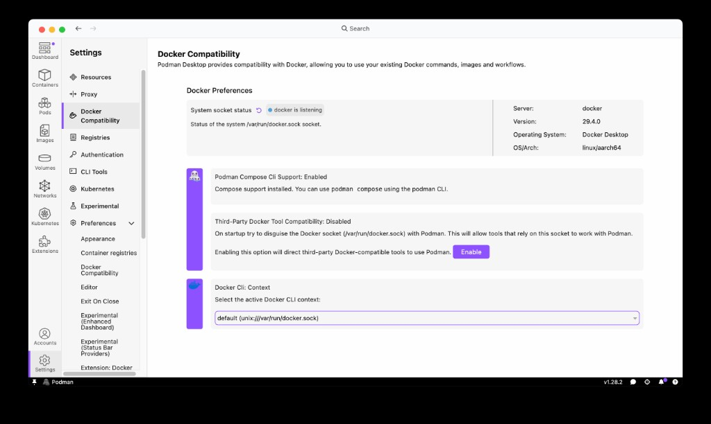

import Tabs from '@theme/Tabs';
import TabItem from '@theme/TabItem';

# Managing Docker compatibility

Many developer tools do not call `docker` or `podman` directly. Instead, they connect to the Docker API through a socket file — `/var/run/docker.sock` on macOS and Linux, or a named pipe on Windows. When you stop Docker Desktop and switch to Podman, this socket disappears and every tool that depends on it breaks.

Podman Desktop's **Docker Compatibility** feature redirects the standard Docker socket to the Podman engine. Once enabled, any program that speaks the Docker API connects to Podman transparently.

## Which tools benefit?

| Tool | How it uses the Docker socket |
|---|---|
| **VS Code Container Tools** | Discovers containers, builds images, attaches to running processes |
| **Testcontainers** (Java, .NET, Go, Node) | Spins up database and service containers for integration tests |
| **JetBrains IDEs** (IntelliJ, GoLand, etc.) | Docker integration panel for building, running, and debugging |
| **GitHub Actions** (self-hosted runners) | Runs container-based actions and service containers |
| **Skaffold, Tilt, DevSpace** | Builds and deploys to local Kubernetes using the Docker API |
| **Docker CLI** | Any `docker` command or shell script using the Docker CLI |

## Prerequisites

Make sure you have:

- [A running Podman machine](/docs/podman/creating-a-podman-machine).
- Enabled the [Docker compatibility](/docs/migrating-from-docker/customizing-docker-compatibility#enable-docker-compatibility) feature.

## Configure the Docker compatibility settings

<Tabs>
   <TabItem value="win" label="Windows" className="markdown">

#### Procedure

1. Go to **Settings > Docker Compatibility**.
2. **System socket status** setting: View the socket mapping status to check whether the socket is reachable.
3. **Docker CLI Context** setting: Select a socket context to work with from the dropdown list.
4. **Podman Compose CLI Support** setting: Check whether the Podman Compose CLI is supported. If not, use the **Setup...** button to install and set up the CLI.
   

If a tool does not auto-detect the socket, set the `DOCKER_HOST` environment variable:

```powershell
$env:DOCKER_HOST = "npipe:////./pipe/docker_engine"
```

</TabItem>
<TabItem value="macOS" label="macOS" className="markdown">

#### Procedure

1. Go to **Settings > Docker Compatibility**.
2. **System socket status** setting: View the socket mapping status to check whether the socket is reachable.
3. **Docker CLI Context** setting: Select a socket context to work with from the dropdown list.
4. **Podman Compose CLI Support** setting: Check whether the Podman Compose CLI is supported. If not, use the **Setup...** button to install and set up the CLI.
5. **Third-Party Docker Tool Compatibility** setting: Customize the setting, if needed. When enabled, you can use third-party Docker tools with Podman.
   

On macOS, **Third-Party Docker Tool Compatibility** is enabled by default through `podman-mac-helper`. If you installed Podman via Homebrew, you may need to run `sudo podman-mac-helper install` once.

</TabItem>
<TabItem value="linux" label="Linux" className="markdown">

#### Procedure

1. Go to **Settings > Docker Compatibility**.
2. **System socket status** setting: View the socket mapping status to check whether the socket is reachable.
3. **Docker CLI Context** setting: Select a socket context to work with from the dropdown list.
4. **Podman Compose CLI Support** setting: Check whether the Podman Compose CLI is supported. If not, use the **Setup...** button to install and set up the CLI.
   

If a tool does not auto-detect the socket, set the `DOCKER_HOST` environment variable in your shell profile:

```shell-session
$ export DOCKER_HOST=unix://$XDG_RUNTIME_DIR/podman/podman.sock
```

</TabItem>
</Tabs>

## Verify the socket points to Podman

Run the following command to confirm that the Docker socket is served by Podman:

```shell-session
$ docker info --format=json | jq -r .ServerVersion
```

The output should return a **Podman** version number (for example `5.8.1`), not a Docker version.

## Verify your tools work

### VS Code Container Tools

The [Container Tools extension](https://marketplace.visualstudio.com/items?itemName=ms-azuretools.vscode-containers) connects to the Docker socket automatically. With Docker Compatibility enabled, you should see the Podman engine in the VS Code Docker sidebar — containers, images, and volumes are listed as before.

If the extension doesn't connect, restart VS Code so it picks up the new socket.

### Testcontainers

[Testcontainers](https://www.testcontainers.com/) discovers the engine through the Docker socket. With Docker Compatibility enabled, it connects to Podman automatically.

One additional setting is required for Podman's rootless mode — Ryuk (the container cleanup daemon) does not work without root:

```shell-session
$ export TESTCONTAINERS_RYUK_DISABLED=true
```

Then run your tests as usual. For a complete walkthrough, see the [Testcontainers with Podman tutorial](/tutorial/testcontainers-with-podman).

### JetBrains IDEs

Go to **Settings > Build, Execution, Deployment > Docker**. The IDE should auto-detect the socket. If it shows "connected", you are done. If not, point the Docker connection to:

- macOS/Linux: `unix:///var/run/docker.sock`
- Windows: `npipe:////./pipe/docker_engine`

### Docker CLI context

Podman Desktop ships with a **Podman Docker Context** extension that automatically creates a Docker CLI context pointing to the Podman socket when a Podman machine starts. Tools that use `docker context` for discovery — such as some CI runners — benefit from this without manual setup.

Verify with:

```shell-session
$ docker context ls
```

You should see a `podman` context listed.

## Additional resources

- [Customizing Docker compatibility](/docs/migrating-from-docker/customizing-docker-compatibility)
- [Using the DOCKER_HOST environment variable](/docs/migrating-from-docker/using-the-docker_host-environment-variable)
- [Testcontainers with Podman tutorial](/tutorial/testcontainers-with-podman)
